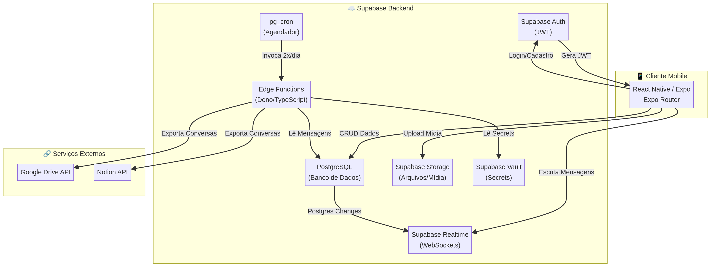
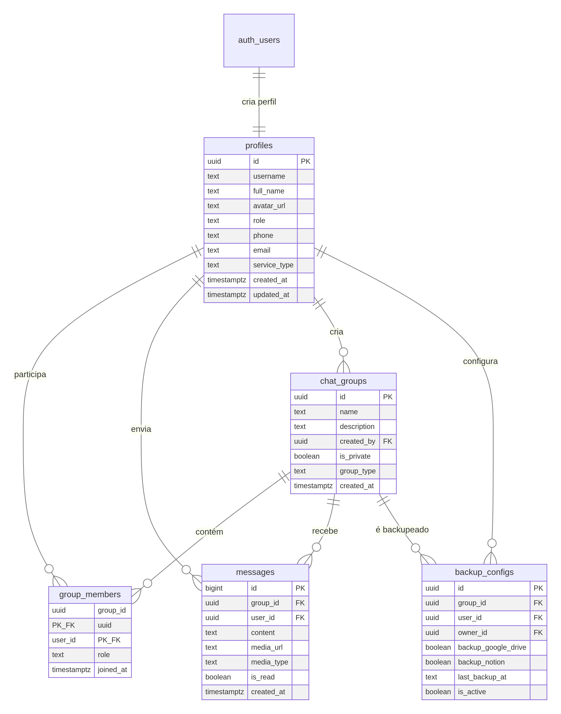

# Especificação Técnica Completa: Plataforma do Aprendiz

**Versão:** 1.0
**Data:** 19 de Fevereiro de 2026
**Autor:** Delineado, arquitetado e implementado pelo Mestre Abraão
**Repositório:** [mestredocomportamento/plataformadoaprendiz](https://github.com/mestredocomportamento/plataformadoaprendiz)

---

## Sumário

1. [Visão Geral do Projeto](#1-visão-geral-do-projeto)
2. [Arquitetura do Sistema](#2-arquitetura-do-sistema)
3. [Modelo de Dados Completo](#3-modelo-de-dados-completo)
4. [Fluxo de Autenticação e Cadastro de Aprendizes](#4-fluxo-de-autenticação-e-cadastro-de-aprendizes)
5. [Arquitetura do Sistema de Chat](#5-arquitetura-do-sistema-de-chat)
6. [Sistema de Grupos e Permissões](#6-sistema-de-grupos-e-permissões)
7. [Mecanismo de Backup Automático](#7-mecanismo-de-backup-automático)
8. [Estrutura de Pastas do Projeto](#8-estrutura-de-pastas-do-projeto)
9. [Telas Principais e Navegação](#9-telas-principais-e-navegação)
10. [APIs e Edge Functions Necessárias](#10-apis-e-edge-functions-necessárias)
11. [Plano de Implementação em Fases](#11-plano-de-implementação-em-fases)
12. [Considerações de Segurança e Performance](#12-considerações-de-segurança-e-performance)

---

## 1. Visão Geral do Projeto

### 1.1 Propósito

A **Plataforma do Aprendiz** é um aplicativo mobile desenvolvido para servir como o ambiente central de comunicação e acompanhamento entre um analista do comportamento (o Mestre) e seus aprendizes — pessoas que decidiram empreender uma jornada de **mudança de padrão comportamental delineado**, seja no formato de corpo, na organização do dia a dia, no estudo ou na área de formação. A plataforma não se enquadra no conceito genérico de "desenvolvimento pessoal"; trata-se de um processo técnico, orientado por análise do comportamento, com acompanhamento direto e personalizado.

### 1.2 Contexto de Negócio

O dono da plataforma é um analista do comportamento que oferece três modalidades de serviço: **treinamento**, **consultoria** e **serviço específico**. Cada modalidade gera uma relação distinta com o aprendiz, e a plataforma deve refletir essa distinção na organização dos grupos de chat, nas permissões de acesso e nos mecanismos de backup. O Mestre tem controle total sobre a plataforma: cadastra aprendizes, cria e gerencia grupos, define quais conversas serão salvas automaticamente e acompanha cada aprendiz de forma individual ou coletiva.

### 1.3 Princípios de Design

A plataforma seguirá os seguintes princípios de design, que devem ser respeitados em toda a implementação:

| Princípio                  | Descrição                                                                                                      |
|----------------------------|-----------------------------------------------------------------------------------------------------------------|
| **Mobile-first**           | Toda a interface será projetada primariamente para dispositivos móveis.                                         |
| **Dark mode**              | O tema padrão será escuro, com fontes sans-serif e uma estética que remete a um terminal.                       |
| **Comunicação leve**       | O chat deve ter um estilo de comunicação leve, fácil de iniciar e manter.                                       |
| **Multimídia**             | O chat deve suportar envio de áudio, imagem e vídeo pelos aprendizes.                                           |
| **Economia de recursos**   | Toda a construção deve ser econômica em termos de créditos e recursos do Supabase.                              |
| **Open source / Free**     | Todas as tecnologias utilizadas devem ser open source ou gratuitas, sem custos adicionais.                      |

### 1.4 Stack Tecnológica Obrigatória

| Camada         | Tecnologia                          | Justificativa                                                                              |
|----------------|--------------------------------------|--------------------------------------------------------------------------------------------|
| Mobile         | React Native com Expo                | Framework cross-platform maduro, com ecossistema rico e suporte a builds OTA.              |
| Navegação      | Expo Router                          | Navegação baseada em arquivos, integrada nativamente ao Expo.                              |
| Backend        | Supabase (PostgreSQL)                | BaaS completo com banco relacional, auth, storage e realtime inclusos no plano gratuito.   |
| Autenticação   | Supabase Auth                        | Autenticação JWT nativa, com suporte a e-mail/senha, magic links e OAuth.                  |
| Chat Realtime  | Supabase Realtime (Postgres Changes) | WebSockets nativos do Supabase que escutam alterações no banco de dados em tempo real. [1]  |
| Armazenamento  | Supabase Storage                     | Armazenamento de arquivos de mídia (imagens, áudio, vídeo) com CDN integrado.              |
| Funções Server | Supabase Edge Functions (Deno)       | Funções serverless para lógica de backend, incluindo backups agendados. [2]                 |
| Agendamento    | pg_cron + pg_net                     | Extensões PostgreSQL nativas para agendar e invocar Edge Functions periodicamente. [2]      |
| Linguagem      | TypeScript                           | Tipagem estática para maior segurança e produtividade no desenvolvimento.                  |

---

## 2. Arquitetura do Sistema

### 2.1 Visão Geral da Arquitetura

A arquitetura segue o modelo **cliente-BaaS (Backend-as-a-Service)**, onde o aplicativo mobile se comunica diretamente com os serviços do Supabase. Não há necessidade de um servidor backend customizado, o que reduz custos e complexidade operacional. O Supabase fornece todos os serviços necessários: autenticação, banco de dados relacional, armazenamento de arquivos, comunicação em tempo real e funções serverless.

O fluxo principal de dados funciona da seguinte maneira: o aplicativo React Native/Expo autentica o usuário via Supabase Auth, que retorna um token JWT. Esse token é usado em todas as requisições subsequentes à API REST do Supabase (para operações CRUD no banco de dados e no storage) e na conexão WebSocket do Supabase Realtime (para receber mensagens de chat em tempo real). As Edge Functions, acionadas por Cron Jobs do `pg_cron`, executam tarefas de background como o backup automático de conversas para o Google Drive e o Notion.

### 2.2 Diagrama de Arquitetura



O diagrama acima ilustra os componentes principais e seus relacionamentos. O cliente mobile se conecta ao Supabase Auth para autenticação, ao PostgreSQL para operações de dados, ao Supabase Realtime para escutar novas mensagens via WebSocket, e ao Supabase Storage para upload e download de mídia. O `pg_cron` agendador invoca as Edge Functions duas vezes ao dia, que por sua vez leem as mensagens do banco de dados e exportam as conversas para o Google Drive e o Notion, utilizando credenciais armazenadas de forma segura no Supabase Vault.

### 2.3 Fluxo de Dados do Chat

O fluxo de dados do chat em tempo real segue este caminho:

1. O aprendiz digita e envia uma mensagem no aplicativo.
2. O cliente executa um `INSERT` na tabela `messages` via API REST do Supabase.
3. O PostgreSQL processa a inserção e, como a tabela está na publicação `supabase_realtime`, emite um evento de mudança.
4. O servidor Supabase Realtime captura esse evento e o transmite via WebSocket para todos os clientes inscritos no canal daquele grupo.
5. Os clientes recebem o payload da nova mensagem e atualizam a interface do chat em tempo real.

---

## 3. Modelo de Dados Completo

### 3.1 Diagrama Entidade-Relacionamento



### 3.2 Tabelas do Supabase

#### 3.2.1 Tabela `profiles`

Esta tabela armazena os dados de perfil de todos os usuários da plataforma, tanto do Mestre (admin) quanto dos aprendizes. Ela é vinculada à tabela `auth.users` do Supabase Auth através do campo `id`.

| Coluna         | Tipo                        | Restrições                                | Descrição                                                                 |
|----------------|-----------------------------|-------------------------------------------|---------------------------------------------------------------------------|
| `id`           | `uuid`                      | PK, FK → `auth.users.id`, ON DELETE CASCADE | Identificador único, vinculado à autenticação.                            |
| `username`     | `text`                      | UNIQUE, NOT NULL                          | Nome de usuário único na plataforma.                                      |
| `full_name`    | `text`                      | NOT NULL                                  | Nome completo do usuário.                                                 |
| `avatar_url`   | `text`                      |                                           | URL da imagem de perfil no Supabase Storage.                              |
| `role`         | `text`                      | NOT NULL, DEFAULT 'aprendiz'              | Papel do usuário: `'admin'` ou `'aprendiz'`.                              |
| `phone`        | `text`                      |                                           | Número de telefone do usuário.                                            |
| `email`        | `text`                      |                                           | E-mail do usuário (espelhado do auth para consultas rápidas).             |
| `service_type` | `text`                      |                                           | Tipo de serviço: `'treinamento'`, `'consultoria'`, `'servico_especifico'`.|
| `is_active`    | `boolean`                   | NOT NULL, DEFAULT true                    | Indica se o aprendiz está ativo na plataforma.                            |
| `created_at`   | `timestamp with time zone`  | NOT NULL, DEFAULT `now()`                 | Data e hora de criação do perfil.                                         |
| `updated_at`   | `timestamp with time zone`  | NOT NULL, DEFAULT `now()`                 | Data e hora da última atualização.                                        |

#### 3.2.2 Tabela `chat_groups`

Representa tanto conversas em grupo quanto conversas individuais (1-1). A distinção é feita pela flag `is_private`.

| Coluna         | Tipo                        | Restrições                                | Descrição                                                                 |
|----------------|-----------------------------|-------------------------------------------|---------------------------------------------------------------------------|
| `id`           | `uuid`                      | PK, DEFAULT `gen_random_uuid()`           | Identificador único do grupo.                                             |
| `name`         | `text`                      | NOT NULL                                  | Nome do grupo (para chats privados, pode ser gerado automaticamente).     |
| `description`  | `text`                      |                                           | Descrição opcional do grupo.                                              |
| `created_by`   | `uuid`                      | NOT NULL, FK → `profiles.id`              | ID do usuário que criou o grupo.                                          |
| `is_private`   | `boolean`                   | NOT NULL, DEFAULT false                   | `true` para chats 1-1, `false` para grupos.                              |
| `group_type`   | `text`                      | NOT NULL, DEFAULT 'geral'                 | Tipo: `'treinamento'`, `'consultoria'`, `'servico_especifico'`, `'geral'`.|
| `avatar_url`   | `text`                      |                                           | URL da imagem do grupo no Supabase Storage.                               |
| `created_at`   | `timestamp with time zone`  | NOT NULL, DEFAULT `now()`                 | Data e hora de criação.                                                   |

#### 3.2.3 Tabela `group_members`

Tabela de junção que associa usuários a grupos de chat. A chave primária composta garante que um usuário não possa ser adicionado duas vezes ao mesmo grupo.

| Coluna       | Tipo                        | Restrições                                | Descrição                                                                 |
|--------------|-----------------------------|-------------------------------------------|---------------------------------------------------------------------------|
| `group_id`   | `uuid`                      | PK, FK → `chat_groups.id`, ON DELETE CASCADE | ID do grupo.                                                              |
| `user_id`    | `uuid`                      | PK, FK → `profiles.id`, ON DELETE CASCADE    | ID do membro.                                                             |
| `role`       | `text`                      | NOT NULL, DEFAULT 'member'                | Papel no grupo: `'admin'`, `'member'`.                                    |
| `joined_at`  | `timestamp with time zone`  | NOT NULL, DEFAULT `now()`                 | Data e hora em que o membro entrou no grupo.                              |

#### 3.2.4 Tabela `messages`

Armazena todas as mensagens de todos os grupos. É a tabela central do sistema de chat e a que será monitorada pelo Supabase Realtime.

| Coluna       | Tipo                        | Restrições                                | Descrição                                                                 |
|--------------|-----------------------------|-------------------------------------------|---------------------------------------------------------------------------|
| `id`         | `bigint`                    | PK, GENERATED ALWAYS AS IDENTITY         | Identificador sequencial da mensagem.                                     |
| `group_id`   | `uuid`                      | NOT NULL, FK → `chat_groups.id`, ON DELETE CASCADE | ID do grupo onde a mensagem foi enviada.                                  |
| `user_id`    | `uuid`                      | NOT NULL, FK → `profiles.id`              | ID do remetente.                                                          |
| `content`    | `text`                      |                                           | Conteúdo textual da mensagem (pode ser `NULL` se for apenas mídia).       |
| `media_url`  | `text`                      |                                           | URL do arquivo de mídia no Supabase Storage.                              |
| `media_type` | `text`                      |                                           | Tipo da mídia: `'image'`, `'audio'`, `'video'`, `NULL`.                   |
| `is_read`    | `boolean`                   | NOT NULL, DEFAULT false                   | Indica se a mensagem foi lida (útil para chats 1-1).                      |
| `created_at` | `timestamp with time zone`  | NOT NULL, DEFAULT `now()`                 | Data e hora de envio.                                                     |

#### 3.2.5 Tabela `backup_configs`

Configurações de backup definidas pelo Mestre. Cada registro indica um grupo (ou usuário específico) cujas conversas devem ser exportadas automaticamente.

| Coluna                | Tipo                        | Restrições                                | Descrição                                                                 |
|-----------------------|-----------------------------|-------------------------------------------|---------------------------------------------------------------------------|
| `id`                  | `uuid`                      | PK, DEFAULT `gen_random_uuid()`           | Identificador da configuração.                                            |
| `group_id`            | `uuid`                      | NOT NULL, FK → `chat_groups.id`, ON DELETE CASCADE | Grupo a ser backupeado.                                                   |
| `user_id`             | `uuid`                      | FK → `profiles.id`                        | Usuário específico (opcional, para backups de conversas individuais).      |
| `owner_id`            | `uuid`                      | NOT NULL, FK → `profiles.id`              | ID do Mestre que configurou o backup.                                     |
| `backup_google_drive` | `boolean`                   | NOT NULL, DEFAULT true                    | Habilita backup para o Google Drive.                                      |
| `backup_notion`       | `boolean`                   | NOT NULL, DEFAULT true                    | Habilita backup para o Notion.                                            |
| `last_backup_at`      | `timestamp with time zone`  |                                           | Timestamp do último backup executado com sucesso.                         |
| `is_active`           | `boolean`                   | NOT NULL, DEFAULT true                    | Indica se esta configuração de backup está ativa.                         |
| `created_at`          | `timestamp with time zone`  | NOT NULL, DEFAULT `now()`                 | Data de criação da configuração.                                          |

### 3.3 SQL de Criação das Tabelas

```sql
-- =============================================================
-- MIGRAÇÃO: Criação do schema da Plataforma do Aprendiz
-- =============================================================

-- 1. Tabela de Perfis
CREATE TABLE public.profiles (
    id UUID PRIMARY KEY REFERENCES auth.users(id) ON DELETE CASCADE,
    username TEXT UNIQUE NOT NULL,
    full_name TEXT NOT NULL,
    avatar_url TEXT,
    role TEXT NOT NULL DEFAULT 'aprendiz' CHECK (role IN ('admin', 'aprendiz')),
    phone TEXT,
    email TEXT,
    service_type TEXT CHECK (service_type IN ('treinamento', 'consultoria', 'servico_especifico')),
    is_active BOOLEAN NOT NULL DEFAULT true,
    created_at TIMESTAMPTZ NOT NULL DEFAULT now(),
    updated_at TIMESTAMPTZ NOT NULL DEFAULT now()
);

-- 2. Tabela de Grupos de Chat
CREATE TABLE public.chat_groups (
    id UUID PRIMARY KEY DEFAULT gen_random_uuid(),
    name TEXT NOT NULL,
    description TEXT,
    created_by UUID NOT NULL REFERENCES public.profiles(id),
    is_private BOOLEAN NOT NULL DEFAULT false,
    group_type TEXT NOT NULL DEFAULT 'geral'
        CHECK (group_type IN ('treinamento', 'consultoria', 'servico_especifico', 'geral')),
    avatar_url TEXT,
    created_at TIMESTAMPTZ NOT NULL DEFAULT now()
);

-- 3. Tabela de Membros dos Grupos
CREATE TABLE public.group_members (
    group_id UUID NOT NULL REFERENCES public.chat_groups(id) ON DELETE CASCADE,
    user_id UUID NOT NULL REFERENCES public.profiles(id) ON DELETE CASCADE,
    role TEXT NOT NULL DEFAULT 'member' CHECK (role IN ('admin', 'member')),
    joined_at TIMESTAMPTZ NOT NULL DEFAULT now(),
    PRIMARY KEY (group_id, user_id)
);

-- 4. Tabela de Mensagens
CREATE TABLE public.messages (
    id BIGINT GENERATED ALWAYS AS IDENTITY PRIMARY KEY,
    group_id UUID NOT NULL REFERENCES public.chat_groups(id) ON DELETE CASCADE,
    user_id UUID NOT NULL REFERENCES public.profiles(id),
    content TEXT,
    media_url TEXT,
    media_type TEXT CHECK (media_type IN ('image', 'audio', 'video')),
    is_read BOOLEAN NOT NULL DEFAULT false,
    created_at TIMESTAMPTZ NOT NULL DEFAULT now()
);

-- 5. Tabela de Configurações de Backup
CREATE TABLE public.backup_configs (
    id UUID PRIMARY KEY DEFAULT gen_random_uuid(),
    group_id UUID NOT NULL REFERENCES public.chat_groups(id) ON DELETE CASCADE,
    user_id UUID REFERENCES public.profiles(id),
    owner_id UUID NOT NULL REFERENCES public.profiles(id),
    backup_google_drive BOOLEAN NOT NULL DEFAULT true,
    backup_notion BOOLEAN NOT NULL DEFAULT true,
    last_backup_at TIMESTAMPTZ,
    is_active BOOLEAN NOT NULL DEFAULT true,
    created_at TIMESTAMPTZ NOT NULL DEFAULT now()
);

-- =============================================================
-- ÍNDICES para performance
-- =============================================================
CREATE INDEX idx_messages_group_id ON public.messages(group_id);
CREATE INDEX idx_messages_created_at ON public.messages(created_at DESC);
CREATE INDEX idx_messages_group_created ON public.messages(group_id, created_at DESC);
CREATE INDEX idx_group_members_user_id ON public.group_members(user_id);
CREATE INDEX idx_backup_configs_active ON public.backup_configs(is_active) WHERE is_active = true;

-- =============================================================
-- PUBLICAÇÃO para Supabase Realtime
-- =============================================================
ALTER PUBLICATION supabase_realtime ADD TABLE public.messages;

-- =============================================================
-- TRIGGER: Criar perfil automaticamente ao cadastrar usuário
-- =============================================================
CREATE OR REPLACE FUNCTION public.handle_new_user()
RETURNS TRIGGER AS $$
BEGIN
    INSERT INTO public.profiles (id, username, full_name, email)
    VALUES (
        NEW.id,
        COALESCE(NEW.raw_user_meta_data->>'username', split_part(NEW.email, '@', 1)),
        COALESCE(NEW.raw_user_meta_data->>'full_name', ''),
        NEW.email
    );
    RETURN NEW;
END;
$$ LANGUAGE plpgsql SECURITY DEFINER;

CREATE TRIGGER on_auth_user_created
    AFTER INSERT ON auth.users
    FOR EACH ROW
    EXECUTE FUNCTION public.handle_new_user();

-- =============================================================
-- TRIGGER: Atualizar updated_at automaticamente
-- =============================================================
CREATE OR REPLACE FUNCTION public.handle_updated_at()
RETURNS TRIGGER AS $$
BEGIN
    NEW.updated_at = now();
    RETURN NEW;
END;
$$ LANGUAGE plpgsql;

CREATE TRIGGER on_profile_updated
    BEFORE UPDATE ON public.profiles
    FOR EACH ROW
    EXECUTE FUNCTION public.handle_updated_at();
```

### 3.4 Políticas de Row Level Security (RLS)

```sql
-- =============================================================
-- RLS: Habilitar em todas as tabelas
-- =============================================================
ALTER TABLE public.profiles ENABLE ROW LEVEL SECURITY;
ALTER TABLE public.chat_groups ENABLE ROW LEVEL SECURITY;
ALTER TABLE public.group_members ENABLE ROW LEVEL SECURITY;
ALTER TABLE public.messages ENABLE ROW LEVEL SECURITY;
ALTER TABLE public.backup_configs ENABLE ROW LEVEL SECURITY;

-- =============================================================
-- RLS: Tabela profiles
-- =============================================================

-- Qualquer usuário autenticado pode ver perfis
CREATE POLICY "Perfis são visíveis para usuários autenticados"
    ON public.profiles FOR SELECT
    TO authenticated
    USING (true);

-- Usuários podem editar apenas o próprio perfil
CREATE POLICY "Usuários podem editar o próprio perfil"
    ON public.profiles FOR UPDATE
    TO authenticated
    USING (auth.uid() = id)
    WITH CHECK (auth.uid() = id);

-- =============================================================
-- RLS: Tabela chat_groups
-- =============================================================

-- Usuários veem apenas grupos dos quais são membros
CREATE POLICY "Usuários veem grupos dos quais são membros"
    ON public.chat_groups FOR SELECT
    TO authenticated
    USING (
        id IN (
            SELECT group_id FROM public.group_members
            WHERE user_id = auth.uid()
        )
    );

-- Apenas admins podem criar grupos
CREATE POLICY "Apenas admins podem criar grupos"
    ON public.chat_groups FOR INSERT
    TO authenticated
    WITH CHECK (
        EXISTS (
            SELECT 1 FROM public.profiles
            WHERE id = auth.uid() AND role = 'admin'
        )
    );

-- Apenas admins podem atualizar grupos
CREATE POLICY "Apenas admins podem atualizar grupos"
    ON public.chat_groups FOR UPDATE
    TO authenticated
    USING (
        EXISTS (
            SELECT 1 FROM public.profiles
            WHERE id = auth.uid() AND role = 'admin'
        )
    );

-- =============================================================
-- RLS: Tabela group_members
-- =============================================================

-- Membros podem ver outros membros do mesmo grupo
CREATE POLICY "Membros veem membros do mesmo grupo"
    ON public.group_members FOR SELECT
    TO authenticated
    USING (
        group_id IN (
            SELECT group_id FROM public.group_members
            WHERE user_id = auth.uid()
        )
    );

-- Apenas admins podem adicionar membros
CREATE POLICY "Apenas admins podem adicionar membros"
    ON public.group_members FOR INSERT
    TO authenticated
    WITH CHECK (
        EXISTS (
            SELECT 1 FROM public.profiles
            WHERE id = auth.uid() AND role = 'admin'
        )
    );

-- Apenas admins podem remover membros
CREATE POLICY "Apenas admins podem remover membros"
    ON public.group_members FOR DELETE
    TO authenticated
    USING (
        EXISTS (
            SELECT 1 FROM public.profiles
            WHERE id = auth.uid() AND role = 'admin'
        )
    );

-- =============================================================
-- RLS: Tabela messages
-- =============================================================

-- Usuários veem mensagens apenas de grupos dos quais são membros
CREATE POLICY "Usuários veem mensagens de seus grupos"
    ON public.messages FOR SELECT
    TO authenticated
    USING (
        group_id IN (
            SELECT group_id FROM public.group_members
            WHERE user_id = auth.uid()
        )
    );

-- Usuários podem enviar mensagens apenas em seus grupos e em seu próprio nome
CREATE POLICY "Usuários enviam mensagens em seus grupos"
    ON public.messages FOR INSERT
    TO authenticated
    WITH CHECK (
        user_id = auth.uid()
        AND group_id IN (
            SELECT group_id FROM public.group_members
            WHERE user_id = auth.uid()
        )
    );

-- =============================================================
-- RLS: Tabela backup_configs
-- =============================================================

-- Apenas admins podem ver e gerenciar configurações de backup
CREATE POLICY "Apenas admins veem backup_configs"
    ON public.backup_configs FOR SELECT
    TO authenticated
    USING (
        EXISTS (
            SELECT 1 FROM public.profiles
            WHERE id = auth.uid() AND role = 'admin'
        )
    );

CREATE POLICY "Apenas admins podem criar backup_configs"
    ON public.backup_configs FOR INSERT
    TO authenticated
    WITH CHECK (
        EXISTS (
            SELECT 1 FROM public.profiles
            WHERE id = auth.uid() AND role = 'admin'
        )
    );

CREATE POLICY "Apenas admins podem atualizar backup_configs"
    ON public.backup_configs FOR UPDATE
    TO authenticated
    USING (
        EXISTS (
            SELECT 1 FROM public.profiles
            WHERE id = auth.uid() AND role = 'admin'
        )
    );

CREATE POLICY "Apenas admins podem deletar backup_configs"
    ON public.backup_configs FOR DELETE
    TO authenticated
    USING (
        EXISTS (
            SELECT 1 FROM public.profiles
            WHERE id = auth.uid() AND role = 'admin'
        )
    );
```

---

## 4. Fluxo de Autenticação e Cadastro de Aprendizes

### 4.1 Métodos de Cadastro

O sistema suporta dois métodos de cadastro de aprendizes, ambos gerenciados pelo **Supabase Auth**:

**Cadastro Manual pelo Mestre:** O Mestre acessa a tela administrativa do aplicativo e preenche os dados do aprendiz (nome completo, e-mail, tipo de serviço). O sistema utiliza a função `supabase.auth.admin.createUser()` (via Edge Function com service role key) para criar o usuário no Supabase Auth com uma senha temporária. O trigger `on_auth_user_created` cria automaticamente o perfil na tabela `profiles`. O Mestre então comunica as credenciais ao aprendiz por outro canal.

**Cadastro Automático via Convite:** O Mestre gera um link de convite (magic link) através da função `supabase.auth.admin.inviteUserByEmail()`. O aprendiz recebe o e-mail, clica no link, é redirecionado ao aplicativo e define sua senha. O trigger cria o perfil automaticamente. Este método é mais seguro pois não envolve comunicação de senhas temporárias.

### 4.2 Fluxo de Login

O login é feito com e-mail e senha através da função `supabase.auth.signInWithPassword()`. O Supabase Auth retorna um par de tokens (access token e refresh token). O access token (JWT) é automaticamente incluído em todas as requisições subsequentes pela biblioteca cliente do Supabase, autenticando o usuário tanto nas operações de banco de dados quanto na conexão WebSocket do Realtime.

### 4.3 Gerenciamento de Sessão

O Expo SecureStore será utilizado para armazenar os tokens de forma segura no dispositivo. A biblioteca `@supabase/supabase-js` gerencia automaticamente a renovação do access token usando o refresh token, garantindo que a sessão do usuário permaneça ativa sem necessidade de login frequente.

### 4.4 Código de Configuração do Cliente Supabase

```typescript
// lib/supabase.ts
import 'react-native-url-polyfill/auto';
import { createClient } from '@supabase/supabase-js';
import * as SecureStore from 'expo-secure-store';
import { Database } from '@/types/supabase';

const ExpoSecureStoreAdapter = {
  getItem: (key: string) => SecureStore.getItemAsync(key),
  setItem: (key: string, value: string) => SecureStore.setItemAsync(key, value),
  removeItem: (key: string) => SecureStore.deleteItemAsync(key),
};

const supabaseUrl = process.env.EXPO_PUBLIC_SUPABASE_URL!;
const supabaseAnonKey = process.env.EXPO_PUBLIC_SUPABASE_ANON_KEY!;

export const supabase = createClient<Database>(supabaseUrl, supabaseAnonKey, {
  auth: {
    storage: ExpoSecureStoreAdapter,
    autoRefreshToken: true,
    persistSession: true,
    detectSessionInUrl: false,
  },
});
```

---

## 5. Arquitetura do Sistema de Chat

### 5.1 Mecanismo: Supabase Realtime com Postgres Changes

O sistema de chat utiliza o recurso **Postgres Changes** do Supabase Realtime [1]. Quando uma nova mensagem é inserida na tabela `messages`, o PostgreSQL emite um evento de mudança que é capturado pelo servidor Realtime e transmitido via WebSocket para todos os clientes inscritos no canal correspondente. Este mecanismo é eficiente porque não requer um servidor de WebSocket customizado — o Supabase gerencia tudo nativamente.

### 5.2 Subscrição no Cliente

Ao abrir uma tela de chat, o cliente se inscreve em um canal específico para aquele grupo, filtrando apenas eventos de `INSERT` na tabela `messages` com o `group_id` correspondente:

```typescript
// hooks/useRealtimeMessages.ts
import { useEffect, useState } from 'react';
import { supabase } from '@/lib/supabase';
import { Message } from '@/types/supabase';

export function useRealtimeMessages(groupId: string) {
  const [messages, setMessages] = useState<Message[]>([]);

  useEffect(() => {
    // Carregar mensagens existentes (com paginação)
    const fetchMessages = async () => {
      const { data } = await supabase
        .from('messages')
        .select('*, profiles:user_id(username, avatar_url)')
        .eq('group_id', groupId)
        .order('created_at', { ascending: false })
        .limit(50);

      if (data) setMessages(data.reverse());
    };

    fetchMessages();

    // Subscrever ao canal Realtime para novas mensagens
    const channel = supabase
      .channel(`chat-${groupId}`)
      .on(
        'postgres_changes',
        {
          event: 'INSERT',
          schema: 'public',
          table: 'messages',
          filter: `group_id=eq.${groupId}`,
        },
        async (payload) => {
          // Buscar dados completos da mensagem com perfil do remetente
          const { data: newMessage } = await supabase
            .from('messages')
            .select('*, profiles:user_id(username, avatar_url)')
            .eq('id', payload.new.id)
            .single();

          if (newMessage) {
            setMessages((prev) => [...prev, newMessage]);
          }
        }
      )
      .subscribe();

    // Limpar subscrição ao sair da tela
    return () => {
      supabase.removeChannel(channel);
    };
  }, [groupId]);

  return messages;
}
```

### 5.3 Envio de Mensagens

O envio de mensagens é feito através de uma simples inserção na tabela `messages`. A política de RLS garante que o `user_id` corresponda ao usuário autenticado e que ele seja membro do grupo:

```typescript
// services/chatService.ts
export async function sendMessage(
  groupId: string,
  userId: string,
  content: string,
  mediaUrl?: string,
  mediaType?: 'image' | 'audio' | 'video'
) {
  const { data, error } = await supabase
    .from('messages')
    .insert({
      group_id: groupId,
      user_id: userId,
      content,
      media_url: mediaUrl,
      media_type: mediaType,
    })
    .select()
    .single();

  if (error) throw error;
  return data;
}
```

### 5.4 Upload de Mídia

O upload de arquivos de mídia (imagens, áudio, vídeo) será feito para o **Supabase Storage**, em um bucket chamado `chat-media`. O caminho do arquivo seguirá o padrão `{group_id}/{timestamp}_{filename}` para organização:

```typescript
// services/mediaService.ts
export async function uploadMedia(
  groupId: string,
  uri: string,
  fileName: string,
  mimeType: string
) {
  const filePath = `${groupId}/${Date.now()}_${fileName}`;

  const response = await fetch(uri);
  const blob = await response.blob();

  const { data, error } = await supabase.storage
    .from('chat-media')
    .upload(filePath, blob, { contentType: mimeType });

  if (error) throw error;

  const { data: urlData } = supabase.storage
    .from('chat-media')
    .getPublicUrl(data.path);

  return urlData.publicUrl;
}
```

---

## 6. Sistema de Grupos e Permissões

### 6.1 Tipos de Grupo

A plataforma suporta os seguintes tipos de grupo, definidos pela coluna `group_type` na tabela `chat_groups`:

| Tipo                  | Descrição                                                                                         |
|-----------------------|---------------------------------------------------------------------------------------------------|
| `treinamento`         | Grupo para aprendizes de treinamento. Pode conter múltiplos aprendizes.                           |
| `consultoria`         | Grupo para aprendizes de consultoria. Pode conter múltiplos aprendizes.                           |
| `servico_especifico`  | Grupo para aprendizes de serviço específico.                                                      |
| `geral`               | Grupo genérico, sem classificação de serviço.                                                     |

### 6.2 Chats Privados (1-1)

Um chat privado entre o Mestre e um aprendiz é representado como um `chat_groups` com `is_private = true`. Ele contém exatamente dois registros na tabela `group_members`. A criação de um chat privado segue esta lógica:

```typescript
export async function createPrivateChat(adminId: string, apprenticeId: string) {
  // Verificar se já existe um chat privado entre os dois
  const { data: existing } = await supabase
    .from('chat_groups')
    .select('id, group_members!inner(user_id)')
    .eq('is_private', true)
    .in('group_members.user_id', [adminId, apprenticeId]);

  // Filtrar para encontrar grupo com ambos os membros
  const existingChat = existing?.find(group => {
    const memberIds = group.group_members.map(m => m.user_id);
    return memberIds.includes(adminId) && memberIds.includes(apprenticeId);
  });

  if (existingChat) return existingChat.id;

  // Criar novo chat privado
  const { data: group } = await supabase
    .from('chat_groups')
    .insert({ name: 'Chat Privado', created_by: adminId, is_private: true })
    .select()
    .single();

  // Adicionar ambos como membros
  await supabase.from('group_members').insert([
    { group_id: group!.id, user_id: adminId, role: 'admin' },
    { group_id: group!.id, user_id: apprenticeId, role: 'member' },
  ]);

  return group!.id;
}
```

### 6.3 Matriz de Permissões

| Ação                              | Admin (Mestre) | Aprendiz |
|-----------------------------------|:--------------:|:--------:|
| Criar grupo                       | Sim            | Não      |
| Editar grupo (nome, descrição)    | Sim            | Não      |
| Deletar grupo                     | Sim            | Não      |
| Adicionar membro ao grupo         | Sim            | Não      |
| Remover membro do grupo           | Sim            | Não      |
| Enviar mensagem no grupo          | Sim            | Sim      |
| Ver mensagens do grupo            | Sim            | Sim      |
| Upload de mídia                   | Sim            | Sim      |
| Configurar backup                 | Sim            | Não      |
| Ver lista de aprendizes           | Sim            | Não      |
| Editar próprio perfil             | Sim            | Sim      |

### 6.4 Sistema de Alertas

Os aprendizes de consultoria devem poder visualizar alertas de todos os grupos de consultoria e alertas específicos destinados a eles. Da mesma forma, aprendizes de treinamento devem ver alertas do grupo de treinamento e alertas individuais. Este sistema será implementado através de notificações push (Expo Notifications) e de uma seção de alertas na interface do aplicativo, filtrando por `group_type` e por destinatário.

---

## 7. Mecanismo de Backup Automático

### 7.1 Visão Geral

O backup automático é uma funcionalidade crítica da plataforma. As conversas dos grupos e pessoas apontados pelo Mestre devem ser salvas automaticamente no **Google Drive** e no **Notion**, com frequência de **duas vezes ao dia**. O mecanismo é composto por três partes: a tabela de configuração (`backup_configs`), o agendador (`pg_cron`) e a função de execução (Edge Function).

### 7.2 Configuração do Agendamento (pg_cron)

O agendamento utiliza as extensões `pg_cron` e `pg_net` do PostgreSQL, disponíveis nativamente no Supabase. As credenciais são armazenadas no Supabase Vault para segurança [2]:

```sql
-- Armazenar credenciais no Vault
SELECT vault.create_secret(
    'https://<PROJECT_REF>.supabase.co',
    'project_url'
);
SELECT vault.create_secret(
    '<SUPABASE_SERVICE_ROLE_KEY>',
    'service_role_key'
);

-- Agendar backup para 08:00 e 20:00 (horário UTC-3 = 11:00 e 23:00 UTC)
SELECT cron.schedule(
    'backup-chats-morning',
    '0 11 * * *',  -- 08:00 BRT
    $$
    SELECT net.http_post(
        url := (SELECT decrypted_secret FROM vault.decrypted_secrets WHERE name = 'project_url')
               || '/functions/v1/backup-chats',
        headers := jsonb_build_object(
            'Content-Type', 'application/json',
            'Authorization', 'Bearer ' ||
                (SELECT decrypted_secret FROM vault.decrypted_secrets WHERE name = 'service_role_key')
        ),
        body := jsonb_build_object('triggered_at', now()::text)
    ) AS request_id;
    $$
);

SELECT cron.schedule(
    'backup-chats-evening',
    '0 23 * * *',  -- 20:00 BRT
    $$
    SELECT net.http_post(
        url := (SELECT decrypted_secret FROM vault.decrypted_secrets WHERE name = 'project_url')
               || '/functions/v1/backup-chats',
        headers := jsonb_build_object(
            'Content-Type', 'application/json',
            'Authorization', 'Bearer ' ||
                (SELECT decrypted_secret FROM vault.decrypted_secrets WHERE name = 'service_role_key')
        ),
        body := jsonb_build_object('triggered_at', now()::text)
    ) AS request_id;
    $$
);
```

### 7.3 Edge Function: `backup-chats`

A Edge Function será escrita em Deno (TypeScript) e executará a seguinte lógica:

```typescript
// supabase/functions/backup-chats/index.ts
import { serve } from 'https://deno.land/std@0.177.0/http/server.ts';
import { createClient } from 'https://esm.sh/@supabase/supabase-js@2';

const supabaseUrl = Deno.env.get('SUPABASE_URL')!;
const supabaseServiceKey = Deno.env.get('SUPABASE_SERVICE_ROLE_KEY')!;
const googleDriveApiKey = Deno.env.get('GOOGLE_DRIVE_API_KEY')!;
const notionApiKey = Deno.env.get('NOTION_API_KEY')!;
const notionDatabaseId = Deno.env.get('NOTION_DATABASE_ID')!;

serve(async (req) => {
  try {
    const supabase = createClient(supabaseUrl, supabaseServiceKey);

    // 1. Buscar configurações de backup ativas
    const { data: configs } = await supabase
      .from('backup_configs')
      .select('*, chat_groups(name)')
      .eq('is_active', true);

    if (!configs || configs.length === 0) {
      return new Response(JSON.stringify({ message: 'Nenhum backup configurado.' }), {
        status: 200,
      });
    }

    for (const config of configs) {
      // 2. Buscar mensagens desde o último backup
      let query = supabase
        .from('messages')
        .select('*, profiles:user_id(full_name)')
        .eq('group_id', config.group_id)
        .order('created_at', { ascending: true });

      if (config.last_backup_at) {
        query = query.gt('created_at', config.last_backup_at);
      }

      if (config.user_id) {
        query = query.eq('user_id', config.user_id);
      }

      const { data: messages } = await query;

      if (!messages || messages.length === 0) continue;

      // 3. Formatar mensagens para exportação
      const formattedMessages = messages.map((msg) => ({
        remetente: msg.profiles?.full_name || 'Desconhecido',
        conteudo: msg.content || '[Mídia]',
        tipo_midia: msg.media_type || 'texto',
        data_hora: msg.created_at,
      }));

      const groupName = config.chat_groups?.name || 'Grupo';
      const timestamp = new Date().toISOString().split('T')[0];
      const backupTitle = `Backup - ${groupName} - ${timestamp}`;

      // 4. Exportar para Google Drive (se habilitado)
      if (config.backup_google_drive) {
        await exportToGoogleDrive(backupTitle, formattedMessages, googleDriveApiKey);
      }

      // 5. Exportar para Notion (se habilitado)
      if (config.backup_notion) {
        await exportToNotion(backupTitle, formattedMessages, notionApiKey, notionDatabaseId);
      }

      // 6. Atualizar timestamp do último backup
      await supabase
        .from('backup_configs')
        .update({ last_backup_at: new Date().toISOString() })
        .eq('id', config.id);
    }

    return new Response(JSON.stringify({ message: 'Backup concluído com sucesso.' }), {
      status: 200,
    });
  } catch (error) {
    return new Response(JSON.stringify({ error: error.message }), { status: 500 });
  }
});

// --- Funções auxiliares ---

async function exportToGoogleDrive(title: string, messages: any[], apiKey: string) {
  const content = messages
    .map((m) => `[${m.data_hora}] ${m.remetente}: ${m.conteudo}`)
    .join('\n');

  // Criar arquivo de texto no Google Drive
  const metadata = {
    name: `${title}.txt`,
    mimeType: 'text/plain',
    parents: ['<GOOGLE_DRIVE_FOLDER_ID>'], // ID da pasta no Drive
  };

  const form = new FormData();
  form.append(
    'metadata',
    new Blob([JSON.stringify(metadata)], { type: 'application/json' })
  );
  form.append('file', new Blob([content], { type: 'text/plain' }));

  await fetch(
    'https://www.googleapis.com/upload/drive/v3/files?uploadType=multipart',
    {
      method: 'POST',
      headers: { Authorization: `Bearer ${apiKey}` },
      body: form,
    }
  );
}

async function exportToNotion(
  title: string,
  messages: any[],
  apiKey: string,
  databaseId: string
) {
  const children = messages.map((m) => ({
    object: 'block',
    type: 'paragraph',
    paragraph: {
      rich_text: [
        {
          type: 'text',
          text: {
            content: `[${m.data_hora}] ${m.remetente}: ${m.conteudo}`,
          },
        },
      ],
    },
  }));

  await fetch('https://api.notion.com/v1/pages', {
    method: 'POST',
    headers: {
      Authorization: `Bearer ${apiKey}`,
      'Content-Type': 'application/json',
      'Notion-Version': '2022-06-28',
    },
    body: JSON.stringify({
      parent: { database_id: databaseId },
      properties: {
        Name: { title: [{ text: { content: title } }] },
      },
      children: children.slice(0, 100), // Notion limita 100 blocos por request
    }),
  });
}
```

### 7.4 Configuração de Secrets no Supabase

As credenciais das APIs externas devem ser configuradas como variáveis de ambiente das Edge Functions:

```bash
supabase secrets set GOOGLE_DRIVE_API_KEY=<token_oauth_google>
supabase secrets set NOTION_API_KEY=<token_integracao_notion>
supabase secrets set NOTION_DATABASE_ID=<id_database_notion>
```

---

## 8. Estrutura de Pastas do Projeto

A estrutura segue as melhores práticas recomendadas para projetos Expo com Expo Router [3]:

```
plataformadoaprendiz/
├── app/                          # Telas e navegação (Expo Router - file-based routing)
│   ├── _layout.tsx               # Layout raiz da aplicação
│   ├── index.tsx                 # Tela de redirecionamento inicial
│   ├── (auth)/                   # Grupo de rotas de autenticação
│   │   ├── _layout.tsx
│   │   ├── login.tsx             # Tela de login
│   │   └── register.tsx          # Tela de cadastro (para convites)
│   ├── (tabs)/                   # Grupo de rotas com navegação por abas
│   │   ├── _layout.tsx           # Layout das abas (Tab Navigator)
│   │   ├── chats.tsx             # Lista de conversas
│   │   ├── groups.tsx            # Lista de grupos (visão admin)
│   │   └── profile.tsx           # Perfil do usuário
│   ├── chat/
│   │   └── [id].tsx              # Tela de chat dinâmico (por group_id)
│   └── admin/                    # Telas administrativas (apenas admin)
│       ├── _layout.tsx
│       ├── manage-users.tsx      # Gerenciar aprendizes
│       ├── manage-groups.tsx     # Gerenciar grupos
│       └── backup-settings.tsx   # Configurar backups
│
├── assets/                       # Recursos estáticos
│   ├── images/
│   └── fonts/
│
├── components/                   # Componentes reutilizáveis
│   ├── chat/
│   │   ├── MessageBubble.tsx     # Bolha de mensagem
│   │   ├── ChatInput.tsx         # Campo de entrada com botões de mídia
│   │   ├── MediaPicker.tsx       # Seletor de imagem/áudio/vídeo
│   │   └── ChatHeader.tsx        # Cabeçalho do chat
│   ├── ui/
│   │   ├── Button.tsx
│   │   ├── Input.tsx
│   │   ├── Avatar.tsx
│   │   └── LoadingSpinner.tsx
│   └── groups/
│       ├── GroupCard.tsx          # Card de grupo na lista
│       └── MemberList.tsx        # Lista de membros do grupo
│
├── constants/                    # Constantes da aplicação
│   ├── Colors.ts                 # Paleta de cores (dark mode)
│   ├── Layout.ts                 # Dimensões e espaçamentos
│   └── Config.ts                 # Configurações gerais
│
├── contexts/                     # Contextos React
│   └── AuthContext.tsx           # Contexto de autenticação
│
├── hooks/                        # Hooks customizados
│   ├── useAuth.ts                # Hook de autenticação
│   ├── useRealtimeMessages.ts    # Hook de mensagens em tempo real
│   └── useProfile.ts             # Hook de perfil do usuário
│
├── lib/                          # Configuração de bibliotecas
│   └── supabase.ts               # Cliente Supabase configurado
│
├── services/                     # Serviços de acesso a dados
│   ├── chatService.ts            # Operações de chat
│   ├── groupService.ts           # Operações de grupos
│   ├── mediaService.ts           # Upload/download de mídia
│   ├── profileService.ts         # Operações de perfil
│   └── backupService.ts          # Operações de backup (admin)
│
├── types/                        # Definições de tipos TypeScript
│   └── supabase.ts               # Tipos gerados pelo CLI do Supabase
│
├── supabase/                     # Configuração do Supabase (local dev)
│   ├── config.toml
│   ├── migrations/               # Migrações SQL
│   │   └── 001_initial_schema.sql
│   └── functions/                # Edge Functions
│       └── backup-chats/
│           └── index.ts
│
├── app.json                      # Configuração do Expo
├── package.json
├── tsconfig.json
├── .env                          # Variáveis de ambiente (NÃO commitar)
├── .env.example                  # Exemplo de variáveis de ambiente
└── .gitignore
```

---

## 9. Telas Principais e Navegação

### 9.1 Mapa de Navegação

A navegação é gerenciada pelo **Expo Router**, que utiliza uma convenção baseada em arquivos. O fluxo principal é:

```
Início
  ├── (auth)                    ← Usuário NÃO autenticado
  │   ├── login.tsx
  │   └── register.tsx
  │
  └── (tabs)                    ← Usuário autenticado
      ├── chats.tsx             ← Tab "Conversas"
      │   └── chat/[id].tsx     ← Tela de chat individual/grupo
      ├── groups.tsx            ← Tab "Grupos" (admin: gerenciar; aprendiz: ver grupos)
      └── profile.tsx           ← Tab "Perfil"
          └── admin/            ← Seção administrativa (apenas admin)
              ├── manage-users.tsx
              ├── manage-groups.tsx
              └── backup-settings.tsx
```

### 9.2 Descrição das Telas

| Tela                   | Rota                        | Descrição                                                                                                                                                                                     |
|------------------------|-----------------------------|-----------------------------------------------------------------------------------------------------------------------------------------------------------------------------------------------|
| **Login**              | `(auth)/login`              | Campo de e-mail e senha. Botão de login. Link para recuperação de senha. Estética dark mode com logomarca adaptada.                                                                           |
| **Cadastro**           | `(auth)/register`           | Tela para aprendizes convidados completarem o cadastro (definir senha, preencher perfil).                                                                                                     |
| **Lista de Conversas** | `(tabs)/chats`              | Lista de todos os chats (privados e em grupo) do usuário, ordenados pela última mensagem. Exibe nome, avatar, preview da última mensagem e indicador de mensagens não lidas.                   |
| **Chat**               | `chat/[id]`                 | Tela de conversa com bolhas de mensagem, campo de texto, botões para envio de mídia (câmera, galeria, áudio). Cabeçalho com nome do grupo/pessoa e avatar.                                    |
| **Grupos**             | `(tabs)/groups`             | Para o admin: lista de todos os grupos com opção de criar, editar e gerenciar membros. Para aprendizes: lista dos grupos dos quais participa.                                                 |
| **Perfil**             | `(tabs)/profile`            | Exibe e permite editar nome, username, avatar e telefone. Botão de logout. Para o admin: link para a seção administrativa.                                                                    |
| **Gerenciar Usuários** | `admin/manage-users`        | Lista de todos os aprendizes cadastrados. Permite cadastrar novos, editar perfis, ativar/desativar e filtrar por tipo de serviço.                                                             |
| **Gerenciar Grupos**   | `admin/manage-groups`       | Permite criar novos grupos, definir tipo, adicionar/remover membros e editar informações do grupo.                                                                                            |
| **Config. de Backup**  | `admin/backup-settings`     | Lista de configurações de backup ativas. Permite selecionar grupos e pessoas para backup, habilitar/desabilitar Google Drive e Notion, e visualizar o status do último backup.                 |

---

## 10. APIs e Edge Functions Necessárias

### 10.1 Operações via API REST do Supabase (Cliente)

Todas as operações CRUD padrão serão realizadas diretamente pelo cliente React Native através da biblioteca `@supabase/supabase-js`, que se comunica com a API REST auto-gerada do Supabase. A segurança é garantida pelas políticas de RLS. As principais operações são:

| Operação                          | Tabela           | Método   | Descrição                                                    |
|-----------------------------------|------------------|----------|--------------------------------------------------------------|
| Listar chats do usuário           | `chat_groups`    | SELECT   | Busca grupos dos quais o usuário é membro.                   |
| Buscar mensagens de um grupo      | `messages`       | SELECT   | Busca mensagens paginadas de um grupo específico.            |
| Enviar mensagem                   | `messages`       | INSERT   | Insere nova mensagem (texto ou com mídia).                   |
| Criar grupo                       | `chat_groups`    | INSERT   | Cria novo grupo (apenas admin).                              |
| Adicionar membro                  | `group_members`  | INSERT   | Adiciona aprendiz a um grupo (apenas admin).                 |
| Remover membro                    | `group_members`  | DELETE   | Remove aprendiz de um grupo (apenas admin).                  |
| Atualizar perfil                  | `profiles`       | UPDATE   | Atualiza dados do próprio perfil.                            |
| Upload de mídia                   | Storage          | UPLOAD   | Envia arquivo para o bucket `chat-media`.                    |
| Configurar backup                 | `backup_configs` | INSERT   | Cria nova configuração de backup (apenas admin).             |

### 10.2 Edge Functions

| Função              | Método | Gatilho                          | Descrição                                                                                                                                                    |
|---------------------|--------|----------------------------------|--------------------------------------------------------------------------------------------------------------------------------------------------------------|
| `backup-chats`      | POST   | `pg_cron` (08:00 e 20:00 BRT)   | Lê as configurações de backup ativas, busca mensagens novas desde o último backup e exporta para Google Drive e/ou Notion.                                   |
| `create-user`       | POST   | Chamada manual pelo admin        | Cria um novo usuário no Supabase Auth usando a service role key (necessário para `auth.admin.createUser`). Recebe e-mail, nome e tipo de serviço como payload.|
| `invite-user`       | POST   | Chamada manual pelo admin        | Envia um convite por e-mail (magic link) para um novo aprendiz usando `auth.admin.inviteUserByEmail`.                                                        |

### 10.3 Database Triggers e Functions

| Trigger/Function       | Tabela Alvo    | Evento                  | Descrição                                                                                |
|------------------------|----------------|-------------------------|------------------------------------------------------------------------------------------|
| `handle_new_user`      | `auth.users`   | AFTER INSERT            | Cria automaticamente um registro na tabela `profiles` quando um novo usuário se cadastra. |
| `handle_updated_at`    | `profiles`     | BEFORE UPDATE           | Atualiza o campo `updated_at` automaticamente em cada modificação do perfil.              |

---

## 11. Plano de Implementação em Fases

A implementação será dividida em quatro fases, priorizando as funcionalidades mais críticas primeiro. Cada fase produz um incremento funcional e testável.

### Fase 1: Fundação e Autenticação (Semanas 1-2)

Esta fase estabelece a base do projeto e garante que o fluxo de autenticação funcione de ponta a ponta.

| Tarefa                                                              | Prioridade |
|---------------------------------------------------------------------|:----------:|
| Inicializar projeto Expo com TypeScript e Expo Router               | Alta       |
| Configurar projeto Supabase (criar ou reativar projeto existente)   | Alta       |
| Executar migração SQL para criar todas as tabelas e políticas RLS   | Alta       |
| Configurar cliente Supabase no app (`lib/supabase.ts`)              | Alta       |
| Implementar tela de login com Supabase Auth                         | Alta       |
| Implementar tela de cadastro/convite                                | Alta       |
| Criar contexto de autenticação (`AuthContext`)                      | Alta       |
| Implementar tela de perfil com edição                               | Média      |
| Configurar tema dark mode e constantes de estilo                    | Média      |
| Configurar `.env` e `.gitignore`                                    | Alta       |

### Fase 2: Sistema de Chat (Semanas 3-4)

Esta fase implementa a funcionalidade principal da plataforma: o chat em tempo real.

| Tarefa                                                              | Prioridade |
|---------------------------------------------------------------------|:----------:|
| Implementar tela de lista de conversas (`chats.tsx`)                | Alta       |
| Implementar tela de chat (`chat/[id].tsx`) com UI de bolhas         | Alta       |
| Integrar Supabase Realtime para receber mensagens em tempo real     | Alta       |
| Implementar envio de mensagens de texto                             | Alta       |
| Implementar upload de mídia (imagem, áudio, vídeo) via Storage     | Alta       |
| Implementar exibição de mídia nas bolhas de mensagem                | Alta       |
| Implementar paginação para mensagens antigas (scroll infinito)      | Média      |
| Implementar indicador de mensagens não lidas                        | Média      |

### Fase 3: Gerenciamento de Grupos e Administração (Semanas 5-6)

Esta fase adiciona as funcionalidades administrativas para o Mestre.

| Tarefa                                                              | Prioridade |
|---------------------------------------------------------------------|:----------:|
| Implementar tela de gerenciamento de grupos (`admin/manage-groups`) | Alta       |
| Implementar criação de grupos com tipo e descrição                  | Alta       |
| Implementar adição/remoção de membros em grupos                     | Alta       |
| Implementar criação de chats privados (1-1)                         | Alta       |
| Implementar tela de gerenciamento de usuários (`admin/manage-users`)| Alta       |
| Implementar Edge Function `create-user` e `invite-user`             | Alta       |
| Implementar sistema de alertas por tipo de serviço                  | Média      |

### Fase 4: Backup Automático e Polimento (Semanas 7-8)

Esta fase implementa o backup automático e refina a experiência do usuário.

| Tarefa                                                              | Prioridade |
|---------------------------------------------------------------------|:----------:|
| Desenvolver Edge Function `backup-chats`                            | Alta       |
| Configurar integração com API do Google Drive                       | Alta       |
| Configurar integração com API do Notion                             | Alta       |
| Configurar `pg_cron` para agendamento 2x/dia                       | Alta       |
| Implementar tela de configuração de backup (`admin/backup-settings`)| Alta       |
| Armazenar secrets no Supabase Vault                                 | Alta       |
| Testes de integração e correção de bugs                             | Alta       |
| Otimização de performance e cache de imagens                        | Média      |
| Preparação para publicação (app.json, ícones, splash screen)        | Média      |

---

## 12. Considerações de Segurança e Performance

### 12.1 Segurança

**Row Level Security (RLS)** é a principal linha de defesa do sistema. Todas as tabelas que contêm dados de usuários têm RLS habilitado, com políticas que garantem que cada usuário só acesse dados que lhe pertencem ou que pertencem a grupos dos quais é membro. As políticas foram detalhadas na Seção 3.4.

**Gerenciamento de Chaves** segue o princípio do menor privilégio. A chave `anon` (publishable key) é a única exposta no cliente mobile e tem acesso limitado pelas políticas de RLS. A `service_role_key`, que tem acesso irrestrito ao banco de dados, é usada exclusivamente nas Edge Functions e armazenada no Supabase Vault, nunca no código do cliente.

**Autenticação JWT** garante que todas as requisições sejam autenticadas. O token JWT é renovado automaticamente pela biblioteca cliente do Supabase, e o armazenamento seguro dos tokens no dispositivo é feito via Expo SecureStore, que utiliza o Keychain no iOS e o EncryptedSharedPreferences no Android.

**Validação de Entrada** deve ser implementada tanto no cliente (para feedback imediato ao usuário) quanto no banco de dados (via constraints `CHECK` e tipos de dados). As políticas de RLS também servem como validação de autorização no nível do banco.

### 12.2 Performance

**Paginação de Mensagens** é essencial para evitar o carregamento de todo o histórico de um grupo de uma vez. A implementação usará cursor-based pagination com o campo `created_at`, carregando 50 mensagens por vez e buscando mais ao fazer scroll para cima.

**Otimização de Imagens** será feita no cliente antes do upload, redimensionando imagens grandes e comprimindo-as para reduzir o uso de banda e storage. A biblioteca `expo-image-manipulator` será utilizada para este fim.

**Cache de Mídia** será implementado usando a biblioteca `expo-image` (que possui cache nativo) para imagens e um sistema de cache local para áudios e vídeos já baixados.

**Gerenciamento de Subscrições Realtime** é crítico para economizar recursos. As subscrições WebSocket serão ativadas apenas quando a tela de chat estiver visível (usando o hook `useFocusEffect` do React Navigation) e desativadas ao sair da tela. Isso evita conexões desnecessárias e reduz o consumo de recursos do Supabase Realtime.

**Índices no Banco de Dados** foram definidos na Seção 3.3 para otimizar as consultas mais frequentes: busca de mensagens por grupo ordenadas por data, busca de membros por usuário, e busca de configurações de backup ativas.

### 12.3 Limites do Plano Gratuito do Supabase

É importante estar ciente dos limites do plano gratuito do Supabase para garantir que a plataforma opere dentro deles:

| Recurso                    | Limite (Plano Free)         | Estratégia de Mitigação                                        |
|----------------------------|-----------------------------|----------------------------------------------------------------|
| Banco de dados             | 500 MB                      | Monitorar crescimento; implementar limpeza de mensagens antigas se necessário. |
| Storage                    | 1 GB                        | Comprimir mídia antes do upload; monitorar uso.                |
| Edge Function invocations  | 500.000/mês                 | Backup 2x/dia = ~60 invocações/mês (muito abaixo do limite).  |
| Realtime connections       | 200 simultâneas             | Gerenciar subscrições cuidadosamente; desconectar ao sair do chat. |
| Auth users                 | Ilimitados (MAU: 50.000)    | Dentro do esperado para a escala do projeto.                   |

---

## 13. Referências

[1] Supabase Docs: Realtime - Postgres Changes. Disponível em: [https://supabase.com/docs/guides/realtime/postgres-changes](https://supabase.com/docs/guides/realtime/postgres-changes)

[2] Supabase Docs: Scheduling Edge Functions. Disponível em: [https://supabase.com/docs/guides/functions/schedule-functions](https://supabase.com/docs/guides/functions/schedule-functions)

[3] Expo Blog: How to organize Expo app folder structure for clarity and scalability. Disponível em: [https://expo.dev/blog/expo-app-folder-structure-best-practices](https://expo.dev/blog/expo-app-folder-structure-best-practices)

---

*Todos os Direitos Reservados ao Mestre Abraão Roberto-Fonseca*
*Delineado, arquitetado e implementado pelo Mestre Abraão*
